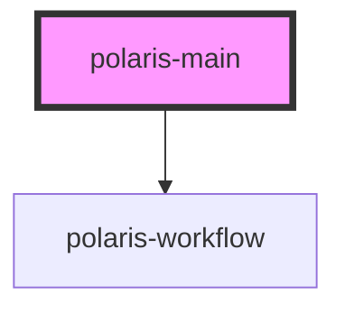

# polaris-main

<!-- Auto Generated Below -->

## Properties

| Property | Attribute | Description | Type      | Default     |
| -------- | --------- | ----------- | --------- | ----------- |
| `ctx`    | --        |             | `Context` | `undefined` |

## Dependencies

### Depends on

- [polaris-workflow](../../polaris-workflow)

### Graph

----------------------------------------------

*Built with [StencilJS](https://stenciljs.com/)*
