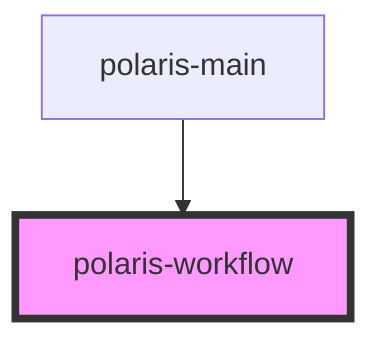

# polaris-workflow

<!-- Auto Generated Below -->

## Properties

| Property    | Attribute    | Description | Type               | Default     |
| ----------- | ------------ | ----------- | ------------------ | ----------- |
| `activity`  | `activity`   |             | `string`           | `undefined` |
| `ctx`       | --           |             | `Context`          | `this`      |
| `process`   | `process`    |             | `object \| string` | `undefined` |
| `sessionId` | `session-id` |             | `string`           | `undefined` |
| `tag`       | `tag`        |             | `string`           | `undefined` |
| `value`     | `value`      |             | `any`              | `undefined` |

## Events

| Event       | Description | Type               |
| ----------- | ----------- | ------------------ |
| `wfMessage` |             | `CustomEvent<any>` |

## Methods

### `load(process: any, next?: string, sessionId?: string) => Promise<void>`

#### Returns

Type: `Promise<void>`

### `setServices(model: ModelService, http: HttpService, config: ConfigService, wf: WorkflowService, validator: ValidatorService) => Promise<void>`

#### Returns

Type: `Promise<void>`

## Dependencies

### Used by

 - [polaris-main](../app/polaris-main)

### Graph

----------------------------------------------

*Built with [StencilJS](https://stenciljs.com/)*
